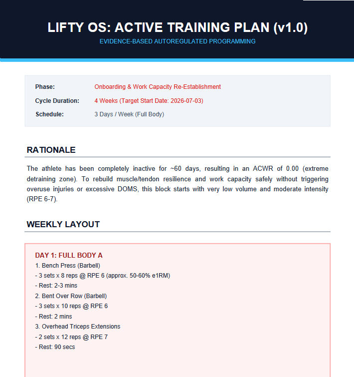

<p align="center">
  
</p>

Lifty OS is a local, evidence-based, autoregulated training and coaching system for powerlifting and bodybuilding. Built around the **Agent-as-Runtime (AAR)** pattern, Lifty OS uses deterministic Python engines for data processing and AI agents to enforce Reactive Training Systems (RTS) principles, manage fatigue, and dynamically adjust training volume and intensity.

Through its **Delta-State Architecture**, Lifty OS bridges the gap between raw training logs (e.g., exported from workout logging apps like Strong) and a fully autoregulated coaching loop. 

## Program Showcase
<p align="center">
  
</p>


## Key Features

- **CNS Fatigue & Overtraining Detection**: Tracks Acute-to-Chronic Workload Ratio (ACWR) and e1RM performance regressions to identify systemic fatigue.
- **Autoregulation**: Implements real-time plan adjustments based on RPE logs and performance trends.
- **Delta-State Extraction**: Synchronizes and extracts only the training data performed since the last coach review. This leads to smarter context window management.
- **Meso-Cycle Graphing**: Generates visual representations of volume curves, RPE distributions, and strength trajectories.
- **Premium printable PDF Plans**: Compiles raw Markdown plans into high-quality, formatted printable PDFs.
- **Cost**: The cost of running the /sync-and-analyze workflow with Gemini 3.5 Flash (Pro tier) in a new chat was roughly 3% of the 5-hour limit, so the workflow is token-efficient. 

## Directory Layout

```
lifty/
├── .agents                   # core workflows
├── README.md                 # System overview, setup, and first steps
├── GEMINI.md                 # Core AI-Coach rules, schemas, and output protocols
├── .agents/
│   ├── rules/                # Prompt instructions for LLM coaching nodes
│   │   ├── coaching_logic.md
│   │   ├── data_ingestion.md
│   │   ├── forensic_analysis.md
│   │   └── pdf_generation.md
│   └── workflows/
│       └── sync-and-analyze.md # Full pipeline automation workflow
├── assets/                   # product screenshots and logo
├── artifacts/                # Temporary diagnostic reports and charts (gitignored)
├── database/
│   ├── goals/
│   │   └── current_goals.md  # Target ratios and training frequencies
│   ├── logs/
│   │   ├── lifting_log_database.csv # Raw csv training log (Strong app export format)
│   │   ├── weight_log.csv           # Bodyweight tracking data
│   │   └── wellness_log.csv         # Sleep, stress, and soreness markers
│   └── metrics/
│       ├── athlete_profile.json     # Custom AI qualitative insights
│       ├── e1rm_history.json        # Strength trajectories over time
│       ├── index.json               # Indexed lookup map of exercises
│       ├── last_query_results.json  # Raw delta sets extracted by query
│       ├── pr_tracking.json         # Current all-time maxes
│       └── meso_state.md            # Engine-calculated ACWR and trends
├── scripts/                  # Deterministic Python backend scripts
│   ├── debounce_check.py     # Check if analysis has run in last 24h
│   ├── generate_training_pdf.py # Compile Markdown plan to premium printable PDF
│   ├── meso_analyzer.py      # Calculate ACWR, e1RM slopes, and generate plots
│   ├── query_metrics.py      # Query, filter, and index raw training logs
│   └── update_timestamp.py   # Record analysis runs to last_forensic_analysis.txt
└── training_plans/
    ├── active_plan.md        # Current active mesocycle training plan
    └── archive/              # Directory for old plans (gitignored)
```

## Dependencies

Lifty OS uses Python 3.10+ and requires the following third-party libraries:

1. **`fpdf2`**: Used to generate high-quality print-ready PDFs for the gym floor.
2. **`matplotlib`**: Generates volume curves, intensity distributions, and e1RM scatter plots.
3. **`numpy`**: Performs mathematical polyfit regression lines for strength trajectories.


## First Steps

Follow these steps to get Lifty OS initialized and running:

### 1. Install Dependencies
Run the following command to install required Python libraries:
```bash
pip install fpdf2 matplotlib numpy
```

### 2. Run Onboarding & Check Setup
If operating inside an agentic IDE, type `/onboard` in the chat. The AI Coach will introduce itself and run a setup verification. You can also type `/import_guide` in the chat to see a guide on exporting and importing your workout logs.

### 3. Configure Profile and Goals
- Edit `database/goals/current_goals.md` to specify your primary lifts, target ratios, and frequency.
- Edit `database/metrics/base_info.json` with your baseline weight, height, gender, and current status (e.g., Bulking, Cutting, Maintenance).

### 4. Import Logs
- Export your lifting history from your workout logging app (Strong) as a CSV, and rename it to `lifting_log_database.csv` under `database/logs/`.

### 5. Execute the Core Pipeline
If operating inside an agentic IDE, use the core `/sync-and-analyze` workflow, which automates the full ingestion, analysis, AI forensic diagnosis, coaching adjustments, and PDF compilation in one step.

You can trigger the entire Lifty OS analytics engine manually by calling:
1. **Extract new logs**: `python scripts/query_metrics.py --start-date yyyy-MM-dd`
2. **Run Meso Analysis**: `python scripts/meso_analyzer.py` (analyzes strength trends, and writes `meso_state.md`).
3. **Generate PDF Plan**: `python scripts/generate_training_pdf.py` (Compiles `training_plans/active_plan.md` to a premium PDF).

## Planned features

### - [ ] Support other workout trackers
### - [ ] Consider nutrition and wellness more for the plan-creation 
### - [ ] Create standalone GUI that uses your own API key
### - [ ] Create /advice rule to ask data-based questions
### - [ ] RAG-System that references papers about exercise science